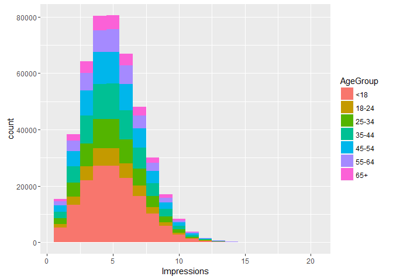
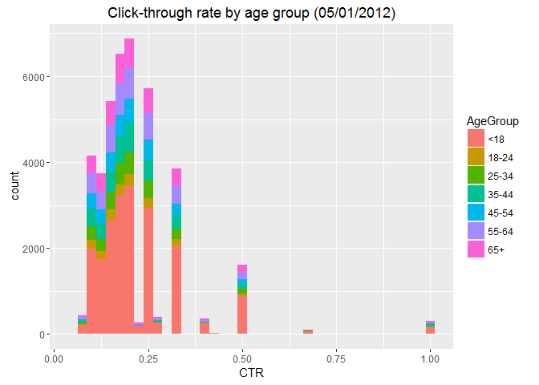

Create the Dataset

    source("MSDS6306_LS8_Mod8.9_Prep.R")

    ## 'data.frame':    458441 obs. of  5 variables:
    ##  $ Age        : int  36 73 30 49 47 47 0 46 16 52 ...
    ##  $ Gender     : int  0 1 0 1 1 0 0 0 0 0 ...
    ##  $ Impressions: int  3 3 3 3 11 11 7 5 3 4 ...
    ##  $ Clicks     : int  0 0 0 0 0 1 1 0 0 0 ...
    ##  $ Signed_In  : int  1 1 1 1 1 1 0 1 1 1 ...
    ## 'data.frame':    455375 obs. of  6 variables:
    ##  $ Age        : int  36 73 30 49 47 47 0 46 16 52 ...
    ##  $ Gender     : int  0 1 0 1 1 0 0 0 0 0 ...
    ##  $ Impressions: int  3 3 3 3 11 11 7 5 3 4 ...
    ##  $ Clicks     : int  0 0 0 0 0 1 1 0 0 0 ...
    ##  $ Signed_In  : int  1 1 1 1 1 1 0 1 1 1 ...
    ##  $ AgeGroup   : Factor w/ 7 levels "<18","18-24",..: 4 7 3 5 5 5 1 5 1 5 ...

Plot the distributions

      ##Plot distributions of number impressions for the age groups
    ggplot(d1, aes(x=Impressions, fill=AgeGroup))+
      geom_histogram(binwidth=1)

<!-- -->

      ##Plot distributions of click-through-rate (CTR = click/impression) for the age groups
    ggplot(subset(d1, CTR>0), aes(x=CTR, fill=AgeGroup))+
      labs(title="Click-through rate by age group (05/01/2012)")+
      geom_histogram(binwidth=.025)

<!-- -->
